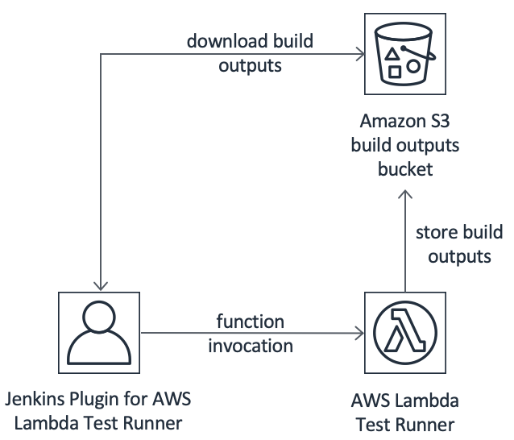

# Jenkins Plugin for AWS Lambda Test Runner

[](https://travis-ci.com/automatictester/lambda-test-runner-jenkins-plugin)

Manage execution of [AWS Lambda Test Runner](https://github.com/automatictester/lambda-test-runner) from Jenkins.

## Project goal

To provide Jenkins users with simple means of using AWS Lambda Test Runner.

## How it works

Jenkins plugin for AWS Lambda Test Runner will:
- Invoke AWS Lambda Test Runner and wait for it to finish.
- Download from S3 any build outputs stored there by AWS Lambda Test Runner.
- Include test execution log from Lambda in Jenkins build console output.
- Unzip any ZIP archives downloaded as part of build outputs.

## Architecture

This is the big picture:



## How to install it

Plugin is not yet available in official Jenkins plugin repository.

Manual installation guide:
- Clone this repo.
- Build HPI file: `./mvnw clean package -DskipTests`.
- Navigate to `https://<your-jenkins-instance>/pluginManager/advanced` and upload
 `target/lambda-test-runner-jenkins-plugin.hpi` under `Upload Plugin`.

Other requirements:
- Required Jenkins version: 2.150.1 or higher.
- Jenkins Master requires IAM permissions for: 
  - Invoking Lambda functions.
  - Downloading content from S3.

## Pipeline example

Jenkins Plugin for AWS Lambda Test Runner adds `lambdaTestRunner` to available Jenkins Pipeline steps. 
Below is a sample Jenkinsfile with Declarative Pipeline which implements complete end-to-end functionality: 

```groovy
#!groovy

pipeline {
    agent {
        label 'master'
    }
    stages {
        stage('Plugin') {
            steps {
                cleanWs()
                lambdaTestRunner branch: 'master', command: './mvnw -pl lightning-core verify -DmockS3 -Dmaven.repo.local=${MAVEN_USER_HOME}', functionName: 'LambdaTestRunner', region: 'eu-west-2', repoUri: 'https://github.com/automatictester/lightning.git', s3Bucket: 'automatictester.co.uk-lambda-test-runner-build-outputs', storeToS3: 'lightning-core/target/surefire-reports,lightning-core/target/failsafe-reports'
                junit 'downloads/**/junitreports/*.xml'
            }
        }
    }
}
```

## Limitations

This plugin will only work when executed from Jenkins Master. Execution from Jenkins Agents is neither 
expected nor supported. If you would like this feature, please vote for [issue #3](https://github.com/automatictester/lambda-test-runner-jenkins-plugin/issues/3).
